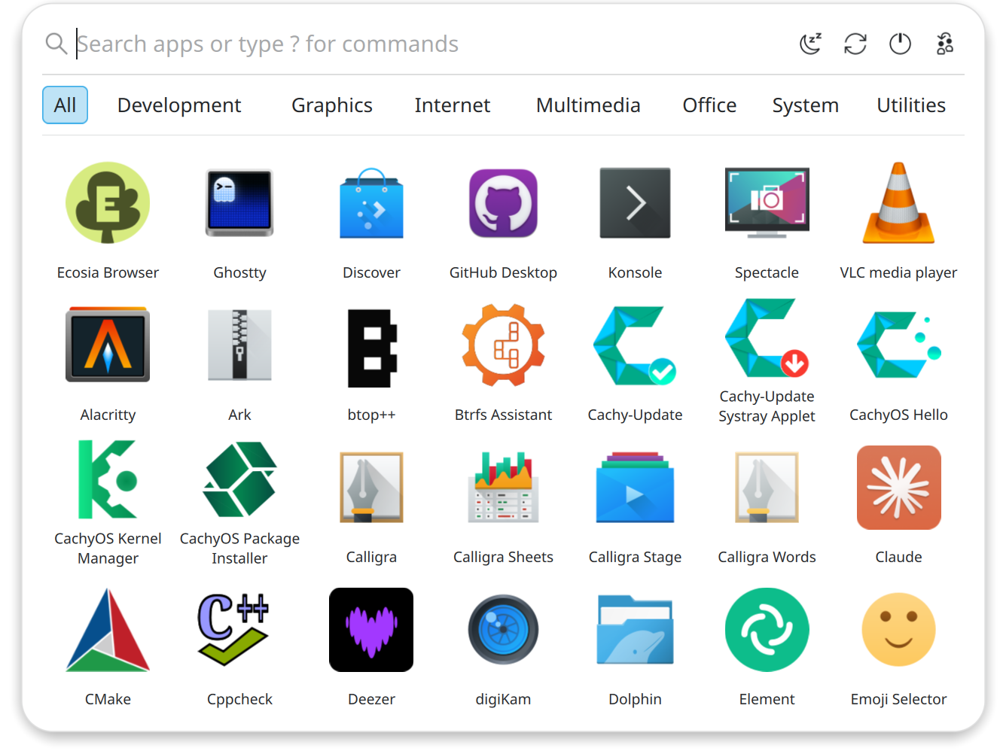
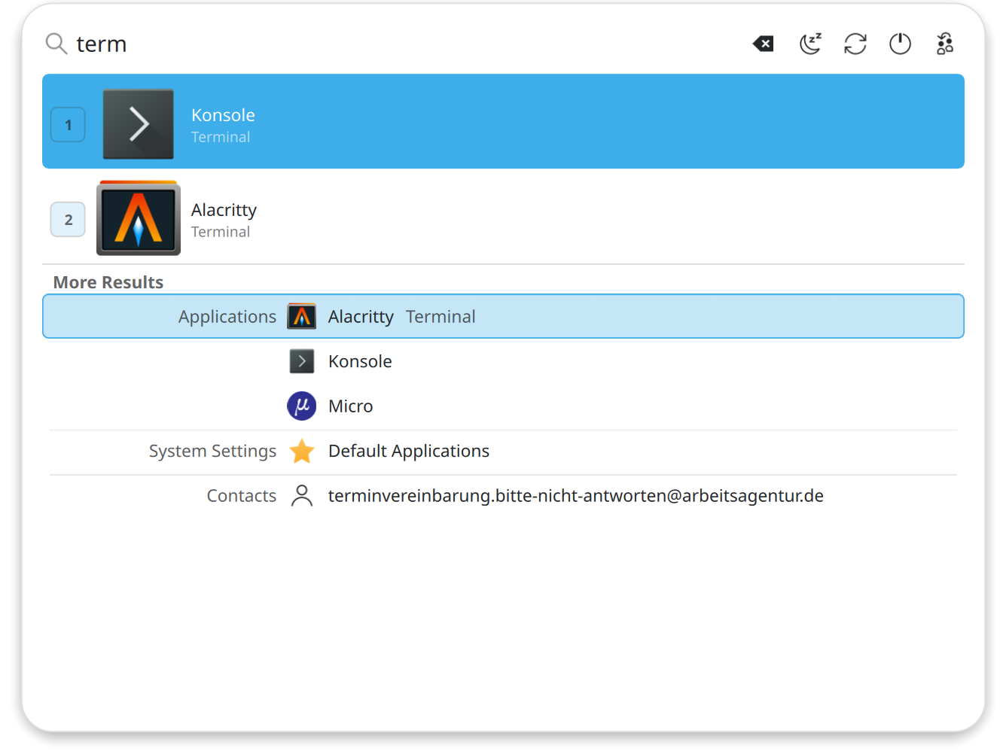
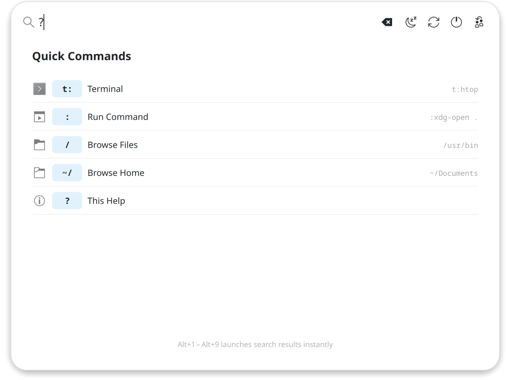
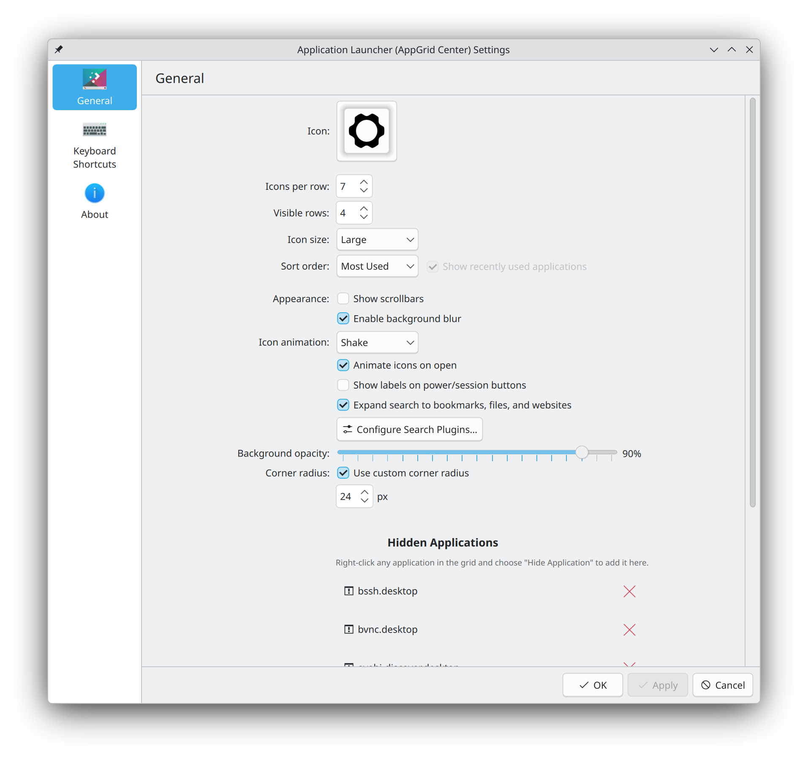

# AppGrid

A modern application launcher for KDE Plasma, inspired by macOS Launchpad, COSMIC, and Pantheon.

AppGrid ships as two plasmoids that share a common codebase:

- **AppGrid** — a standalone window launcher with its own blur, opacity, and corner radius settings.
- **AppGrid (Panel)** — a native Plasma panel popup that opens anchored to the panel icon, just like Kickoff. For those who prefer the traditional style.

Both variants share the same app grid, search, categories, quick commands, and configuration — pick whichever fits your workflow. Requires version 1.2+.

> **Note:** Starting with the 1.5.x release, AppGrid is considered feature complete. The focus going forward will be on stability, polish, and community-requested improvements. AppGrid is still a young project and may contain bugs or not work as expected on all setups. A big thank you to everyone who has been testing, reporting issues, and providing feedback — it has been invaluable in shaping the project. If you run into any issues, please [open an issue](https://github.com/xarbit/plasma6-applet-appgrid/issues) and report back.

> **Compatibility:** AppGrid targets KDE Plasma 6 and supports a wide range of distributions. Multi-monitor screen selection works best with LayerShellQt 6.6+, but falls back to the older API on earlier versions. Pre-built packages are provided for Arch Linux (AUR), Fedora, openSUSE Tumbleweed, Ubuntu 25.04+, and Debian 13+.


## Why AppGrid?

KDE Plasma ships with Kickoff and Kicker as its default application launchers. While they are feature-rich, I find them difficult to navigate and slower to use for everyday app launching. I've always preferred the simplicity of how COSMIC, macOS Launchpad, and Pantheon handle application launching — a clean grid where everything is visible at a glance. Since nothing like that existed for Plasma, I decided to build one that fits my workflow.

## Screenshots









## Features

- **Two plasmoid variants** — standalone window launcher, or a native Plasma panel popup (like Kickoff)
- Favorites tab — right-click any app to add it, with optional start-on-favorites mode and reorderable positions
- Category filtering with scrollable category bar, mouse wheel support, and Alt+key mnemonic navigation
- Option to hide the category bar for a minimal look
- **Two category modes** — simplified built-in categories for a clean look, or system categories that respect KDE Menu Editor changes
- KDE Menu Editor integration — right-click categories to edit them (system categories mode)
- **Unified search** — app results and KRunner results (windows, bookmarks, calculator, web search, etc.) merged into a single seamless list with continuous Tab/arrow navigation and Alt+1–9 shortcuts
- Duplicate filtering — apps already shown in app results are automatically hidden from KRunner results
- Application actions (jumplist) — right-click any app to see its actions (e.g., Firefox → New Private Window)
- Quick commands — terminal, shell commands, file browser (type `?` for help)
- Configurable terminal shell for quick commands (`/bin/sh`, `/bin/bash`, `/bin/zsh`, etc.)
- Sort by most used or alphabetically
- New app detection with badge
- Configurable icon hover animations — shake, grow, bounce, spin, shuffle, or none
- Session management (sleep, restart, shut down, lock, log out)
- Context menu with add to favorites, pin to Task Manager, add to Desktop, hide apps
- Customizable grid size, icon size, background blur, opacity, and corner radius
- Multi-monitor support — configurable to open on active screen (mouse focus) or panel screen
- Reset to defaults button for easy configuration recovery
- Drop-in replacement via Plasma's Show Alternatives

## Dependencies

### Runtime
- plasma-workspace
- kservice
- ki18n
- kio
- krunner
- layer-shell-qt

### Build
- cmake
- extra-cmake-modules
- qt6-base
- qt6-declarative
- libplasma
- kpackage
- kio
- kcoreaddons
- krunner
- kwindowsystem
- layer-shell-qt
- gettext

## Installation

### Pre-built packages

Pre-built packages for Fedora, openSUSE, Ubuntu, and Debian are available on the [Releases](https://github.com/xarbit/plasma6-applet-appgrid/releases) page. These are auto-generated and provided as is — I'm not a packager, and they may not follow all distro packaging standards. Ideally, distribution maintainers would pick up AppGrid for their official repositories. If you're a packager and want to maintain AppGrid for your distro, please reach out so I can link to your package and eventually retire these from the CI pipeline.

### Arch Linux (AUR) — officially supported

The AUR package is maintained by the author and is the only officially supported package at this time.

```bash
yay -S plasma6-applets-appgrid
```

## Building from source

```bash
cmake -B build -DCMAKE_BUILD_TYPE=Release -DCMAKE_INSTALL_PREFIX=/usr
cmake --build build -j$(nproc)
sudo cmake --install build
```

After installing, restart Plasma:

```bash
kquitapp6 plasmashell && kstart plasmashell
```

## Usage

1. Right-click your current application launcher in the panel
2. Select **Show Alternatives**
3. Choose **AppGrid**

Or add it as a new widget: right-click the panel → **Add Widgets** → search for **AppGrid**.

There are two variants:
- **AppGrid** — opens as a standalone window
- **AppGrid (Panel)** — opens as a native Plasma popup anchored to the panel icon, like Kickoff

### Keyboard shortcuts

| Key | Action |
|-----|--------|
| Super | Toggle AppGrid |
| Escape | Close |
| Enter | Launch top search result |
| Alt+1–9 | Launch numbered search result (apps and KRunner results) |
| Alt+letter | Jump to category by mnemonic |
| Arrow keys | Navigate results |
| Tab | Cycle through search results (apps + KRunner unified) |
| Type anywhere | Start searching |

## Configuration

Right-click the AppGrid panel icon → **Configure AppGrid** → **General**.


| Setting | Description | Default |
|---------|-------------|---------|
| **Icon** | Panel icon or custom image | `start-here-kde-symbolic` |
| **Icons per row** | Number of columns in the grid | 7 |
| **Visible rows** | Number of rows visible before scrolling | 4 |
| **Icon size** | Small, medium, or large | Large |
| **Sort order** | **Alphabetical** sorts apps A–Z. **Most Used** sorts by launch frequency, so your most opened apps appear first. | Most Used |
| **Show category bar** | Show or hide the category filter bar. When hidden, all apps are shown. | On |
| **Search all apps** | Search covers all apps regardless of the active category or favorites tab | On |
| **Start with favorites tab** | Open the launcher showing only your favorited apps instead of all apps | Off |
| **Use system categories** | Use KDE menu system categories instead of simplified built-in mapping. Supports KDE Menu Editor for renaming and organizing categories. | Off |
| **Terminal shell** | Shell used for `t:` quick commands | Default (/bin/sh) |
| **Show scrollbars** | Show scrollbars in grid and search views | Off |
| **Enable background blur** | Blur effect behind the launcher (AppGrid only) | On |
| **Icon animation** | Hover and open animation style — None, Shake, Grow, Bounce, Spin, or Shuffle | Shake |
| **Animate icons on open** | Play the selected animation on all icons when the launcher opens (requires an animation selected above) | On |
| **Show labels on power/session buttons** | Text labels on sleep, restart, shut down, etc. | Off |
| **Expand search to bookmarks, files, and websites** | Use additional KRunner plugins for search | On |
| **Background opacity** | Opacity of the launcher background (AppGrid only) | 85% |
| **Corner radius** | Override the default corner radius (AppGrid only) | 24 px (off by default) |
| **Hidden Applications** | Apps hidden from the grid via right-click → Hide | — |

> **Note:** The **AppGrid (Panel)** variant shares most settings but does not include background blur, opacity, or corner radius options — those are managed by Plasma's native popup.

## FAQ

**Why isn't there a `.plasmoid` file I can install from the KDE Store?**

AppGrid uses a C++ backend for app discovery, window management, blur effects, and session actions. The `.plasmoid` format only supports pure QML plasmoids — it has no mechanism to install the compiled plugin (`.so`) to the system plugin path where Plasma expects it. This is the same reason KDE's own C++ plasmoids (Kickoff, Kicker, etc.) are only distributed via system packages. AppGrid provides packages for Arch, Fedora, openSUSE, Ubuntu, and Debian.

**How do I reorder my favorites?**

Switch to the favorites tab, then click the edit button (pencil icon) in the bottom-right corner. Icons will start wiggling. Click an icon to select it, then click another to swap their positions. You can also remove favorites by clicking the remove button on each icon. Click the done button (checkmark). Your order is saved automatically.

**What are the two category modes?**

By default, AppGrid uses a simplified built-in category mapping that groups apps into clean categories like Development, Graphics, Internet, Multimedia, Office, System, and Utilities. If you enable "Use system categories" in settings, AppGrid reads categories directly from the KDE menu system. This respects any changes made in KDE Menu Editor — you can rename, reorganize, or create custom categories and AppGrid will reflect them automatically. Right-click any category to open the Menu Editor.

## Credits

- **Jason Scurtu** — Author
- **[@claude](https://github.com/claude)** — AI pair programming assistant

Disclaimer:
This project uses [Claude Code](https://claude.ai/claude-code) as an AI pair programmer and AI assistant. To be clear: this is **not** vibe-coded — it is context engineered and reviewed. Nevertheless, if AI-assisted code gives you the ick, this might not be the launcher for you.

## Contributing

Contributions are welcome! Here's how you can help:

- **Bug reports** — [open an issue](https://github.com/xarbit/plasma6-applet-appgrid/issues) with steps to reproduce, your Plasma version, and any relevant screenshots
- **Translations** — translation files are in `po/`. Add or improve translations for your language and submit a pull request
- **Packaging** — if you maintain packages for a Linux distribution and want to package AppGrid, please reach out
- **Code** — fork the repo, create a feature branch, and submit a pull request. Please keep changes focused and test on both plasmoid variants (AppGrid Center and AppGrid Panel)

## License

GPL-2.0-or-later
